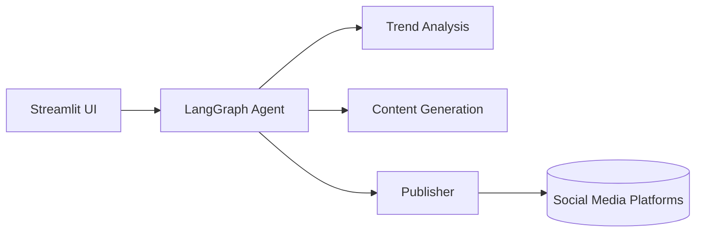

# Architecture Diagram

```mermaid
flowchart LR
    UI[Streamlit UI] --> AG[LangGraph Agent]
    AG --> TA[Trend Analysis]
    AG --> CG[Content Generation]
    AG --> PB[Publisher]
    PB --> SM[(Social Media Platforms)]
```

The agent fetches trending topics, generates content using LLM providers, and publishes to selected social media platforms.
